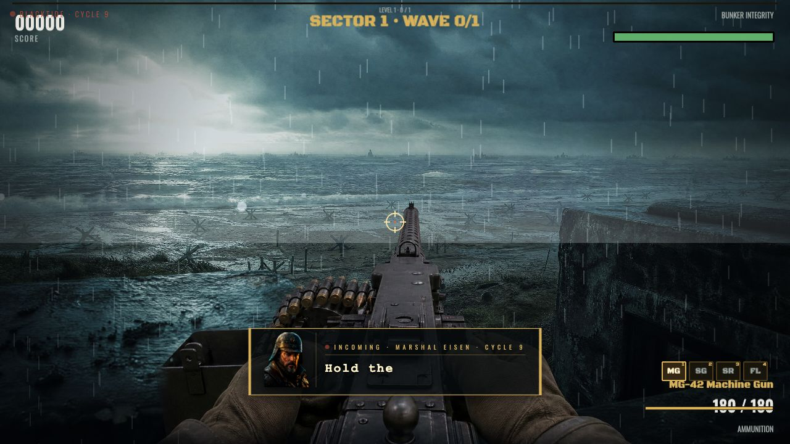

# BLACKTIDE · Siege of the Last Cape

> A cinematic 2D first-person shooter. Marshal Eisen holds the Last Cape against the **black tide** of drowned dead. **Cycle 9** has begun.
>
> 一款电影化 2D 第一人称射击游戏。马歇尔·艾森 (Marshal Eisen) 据守 Last Cape，对抗自黑潮中涌来的溺亡之尸。**第九轮回**降临。

<p align="center">
  
</p>

<p align="center">
  <em>“The lighthouse is the last word. When it dies, the world forgets we were here.” — Marshal Eisen, Cycle 9</em>
</p>

---

## Table of Contents · 目录

- [Overview](#overview)
- [Features](#features)
- [Tech Stack](#tech-stack)
- [Quick Start](#quick-start)
- [Controls](#controls)
- [Evolution Timeline](#evolution-timeline)
- [Credits](#credits)
- [License](#license)

---

## Overview

**BLACKTIDE · Siege of the Last Cape** is a single-file, browser-native cinematic FPS rendered in 2D. You play as **Marshal Eisen**, the last warden of the Last Cape lighthouse, holding the line across **10 hand-tuned waves** (~5 minutes to clear) against the rising drowned dead.

The game blends arcade-feel gunplay with cinematic presentation: real orchestral score, AI-generated 4K photoreal textures, full-motion cutscenes between chapters, and a hand-written 10-chapter epigraph that frames each wave as a journal entry from Eisen himself.

中文简介：单文件浏览器原生电影化 FPS。玩家扮演 **Marshal Eisen**，在 Last Cape 灯塔进行 10 关守城战（约 5 分钟可通关）。游戏融合街机射击手感与电影化叙事——真管弦配乐 / AI 生成的 4K 真人风贴图 / 章节过场视频 / 10 章艾森手记。

**Live Demo · 在线试玩**: `[PLACEHOLDER · filled in by Workflow Verify stage]`

---

## Features

### Gameplay
- **10 escalating waves** — clearable in ~5 minutes, designed for replay
- **4 weapons** — MG (Machine Gun) / SG (Shotgun) / SR (Sniper Rifle) / FL (Flamer), each with distinct recoil, spread, and rhythm
- **8 enemy archetypes** — from shambling drowned to lighthouse-climbing wraiths
- **2 cinematic bosses** — **Tidelord** (mid-game) and **Leviathan** (final), both with **8-frame multi-angle sprite sets** and phase transitions
- **5 dynamic battle scenes** — lighthouse deck, breakwater, drowned chapel, abyssal trench, the lantern room — switching with the story

### Presentation
- **10-chapter epigraph** — each wave opens with a journal entry from Eisen
- **Telegraph-style subtitle system** — Eisen's voice over the radio between volleys
- **Portrait dialogue** — Eisen's portrait reacts to wave intensity and health
- **Full-motion intro / interlude / ending cutscenes** — generated with cinematic video models

### Audio
- **Real orchestral BGM** — composed via **Gemini Lyria**, layered by scene
- **Procedural WebAudio SFX** — gunfire, reloads, impacts, monster vocals

---

## Tech Stack

| Layer | Choice |
| --- | --- |
| Runtime | **Single-file HTML** — no build step, no bundler |
| Engine | **Phaser 3.80** via CDN |
| Audio | **WebAudio API** + **Gemini Lyria** orchestral stems |
| Textures | **GPT-Image-2** — 4K photoreal stills |
| Cutscenes | **Pippit Seedance** — cinematic full-motion video |
| Bosses | 8-frame multi-angle sprite sheets (AI-assisted) |

> Everything ships in one `index.html`. Open it, play it. That's the entire deploy.
>
> 一切都打包在单一 `index.html` 中——打开即玩，这就是全部部署流程。

---

## Quick Start

```bash
# Option A — open directly
open index.html

# Option B — serve locally (recommended for video autoplay policies)
npx serve .
# then visit http://localhost:3000
```

No `npm install`. No build. No bundler. No env vars required for play.

无需 `npm install`、无需构建、无需打包器、无需环境变量。

---

## Controls

| Input | Action |
| --- | --- |
| **Mouse** | Aim |
| **LMB (hold)** | Fire |
| **1 / 2 / 3 / 4** | Switch weapon (MG / SG / SR / FL) |
| **R** | Reload |
| **P** | Pause |
| **M** | Mute |

---

## Evolution Timeline

This game was built across **30 rounds of AI-driven iteration** — wave tuning, sprite re-rolls, boss phase choreography, BGM stem swaps, cutscene re-shoots. Every round is logged.

本作经历 **30 轮 AI 自主迭代**——关卡调参、立绘重抽、BOSS 分阶编排、BGM 分轨替换、过场重拍，每一轮均留有记录。

- Full ledger: [`docs/04-evolve/ledger.tsv`](docs/04-evolve/ledger.tsv)
- Highlight stills: [`docs/demo/`](docs/demo/)
  - `r28-lev-phase2-rage.jpg` — Leviathan Phase 2 enrage
  - `r30-eisen-portrait.jpg` — Final Eisen portrait

---

## Credits

Built with **Claude Sonnet** inside the **GEI Agent Studio** — a multi-agent delivery pipeline where:

- **Alan** — CEO / orchestrator, owns scope and phase gates
- **Mia** — design lead, owns visual direction and cutscene art
- **Zhou** — frontend lead, owns Phaser integration and the single-file build
- **…and supporting specialists** — for audio, evolution loops, and QA

由 **Claude Sonnet** 在 **GEI Agent Studio** 多智能体交付流水线中构建：Alan 任 CEO 总编排，Mia 主美术与过场，Zhou 主前端与 Phaser 集成，以及其余领域专家协同。

---

## License

[MIT](LICENSE)
